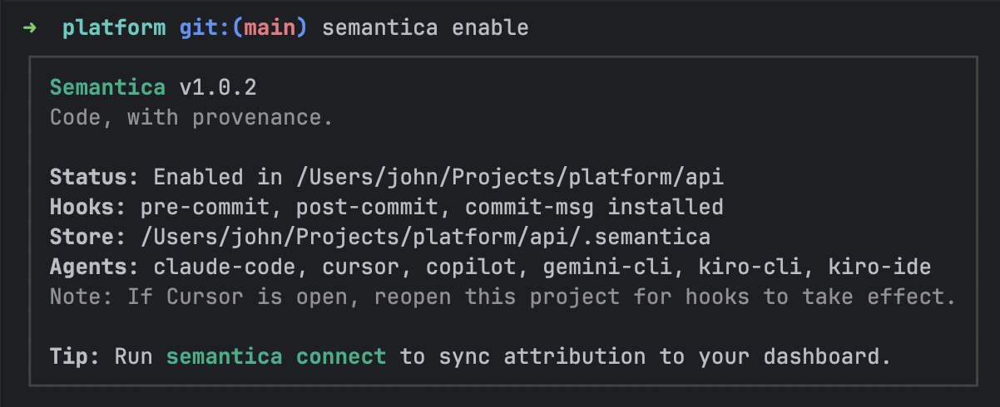
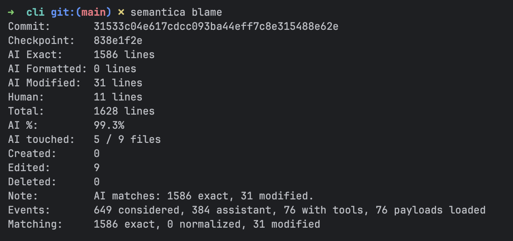
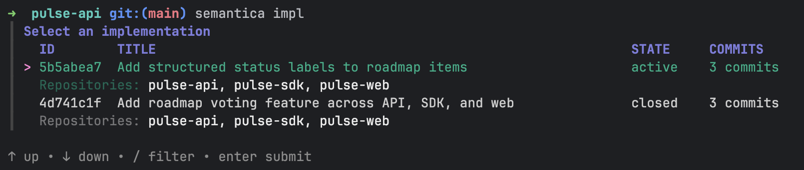
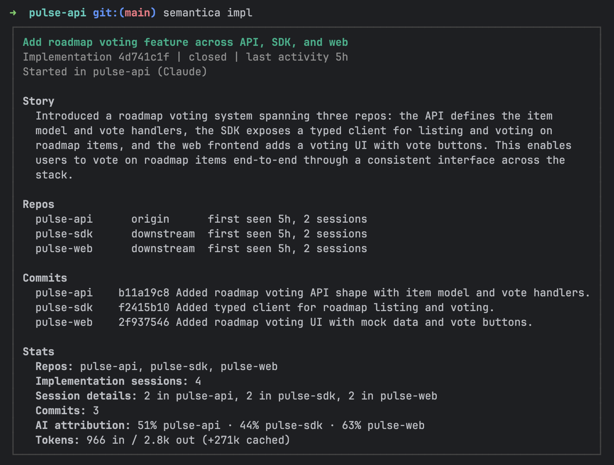
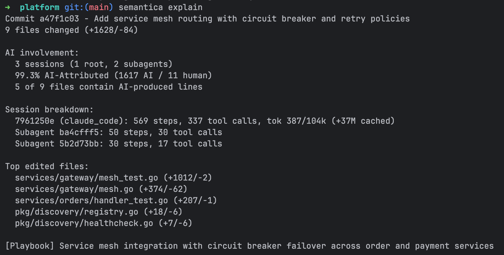

# Semantica

**Code provenance and attribution for AI-assisted development.**

[](https://github.com/semanticash/cli/actions/workflows/ci.yml)
[](LICENSE)

Semantica tracks AI coding activity in your repositories and ties it to your Git workflow. It makes AI code provenance, attribution, and semantic lineage visible across commits, pull requests, and repos.

It answers the question Git cannot: **who or what wrote this code, and how did it happen?**

It works by installing lightweight Git hooks that capture checkpoints, ingest AI agent data, and compute attribution locally.
Core capture works with zero configuration beyond `semantica enable`.

Website: [semantica.sh](https://www.semantica.sh)

---

## Why Semantica
- Make AI-assisted code changes understandable, reviewable, and attributable.
- Connect agent activity to commits and pull requests so teams can trace how work happened.
- Track one implementation story even when agents carry the work across multiple repositories.
- Reduce ambiguity during code review, debugging, handoff, and incident analysis.
- Keep provenance and attribution local by default, with optional hosted sync for team visibility.
- Build trust in AI-assisted software development with a clear system of record that supports audit and compliance.

---

## Requirements

- **Git** - Semantica hooks into the Git commit lifecycle
- **macOS or Linux** - the only supported platforms ([details](docs/limitations.md))
- **At least one supported AI provider** for capture (Claude Code, Cursor, Gemini CLI, Copilot, or Kiro IDE/CLI)
- **At least one supported CLI version** for `suggest commit`, `suggest pr`, and playbook generation (`claude`, `agent`, `gemini`, or `copilot`) - not required for core capture and attribution

---

## Install

### Shell script (macOS / Linux)

```bash
curl -fsSL https://semantica.sh/install.sh | sh
```

### Homebrew (macOS)

```bash
brew install semanticash/tap/semantica
```

The Homebrew cask installs the `semantica` binary plus shell completions for Bash, Zsh, and Fish.

### From source

Requires Go 1.26+.

```bash
git clone https://github.com/semanticash/cli.git
cd cli
make build          # binary at ./bin/semantica
make install        # installs to /usr/local/bin
```

### Shell completions

Homebrew installs completions automatically. For shell script or source installs, load them from the CLI:

```bash
source <(semantica completion zsh)     # zsh
source <(semantica completion bash)    # bash
semantica completion fish | source     # fish
```

---

## Quick start

```bash
cd /path/to/your/repo
semantica enable        # installs hooks, detects AI providers, creates baseline checkpoint
```
<p align="left">
  
</p>
That's it. Every commit now automatically:

1. Creates a checkpoint (file manifest snapshot)
2. Ingests agent session data from detected providers
3. Computes AI attribution (how much of the commit is AI-attributed)
4. Links everything to the commit hash

All capture and attribution data are stored locally in `.semantica/` - a directory alongside `.git`, added to `.gitignore` automatically. 
Semantica never writes to Git history or creates side branches; lineage metadata lives in its own database and content-addressed blob store.

Each completed AI turn is also packaged locally into a provenance bundle. The
bundle references the prompt and step blobs captured for that turn. When a
provider transcript includes enough structured detail, packaging can also fill
in missing step provenance from transcript evidence before the bundle is saved
under `.semantica/` or later synced. File-backed provenance for paths ignored
by Git stays local and is omitted from packaged step bundles.

For optional hosted features, authenticate once and then connect each repo:

```bash
semantica auth login      # global authentication
semantica connect         # connect this repo for hosted features
```

If a repo is already connected through a shared workspace, `semantica connect`
will offer to request access. Workspace owners and admins can review pending
requests with `semantica workspace requests`.

The CLI works fully offline without any remote configuration. Connecting a repo only affects optional hosted sync. Local capture, checkpoints, attribution, rewind, and playbooks continue to work the same way.
Before prompt content or remote sync payloads leave the machine, Semantica applies best-effort secret redaction and normalizes known provenance path fields to repo-relative form where possible. This applies only to outbound sync artifacts. Local raw capture in `.semantica/` is left unchanged. 

---

## What you get

### AI attribution

See what percentage of a commit was AI-attributed, broken down by file:

```bash
semantica blame HEAD
semantica blame HEAD --json      # per-file breakdown
```
If you run `semantica blame` without a ref in a terminal, Semantica shows an interactive checkpoint picker. In non-interactive use, pass a ref explicitly.
<p align="left">
  
</p>

Each commit gets a machine-readable checkpoint trailer, and can also append attribution and diagnostics trailers:

```text
Semantica-Checkpoint: chk_abc123
Semantica-Attribution: 42% claude_code (18/43 lines)
Semantica-Diagnostics: 3 files, lines: 15 exact, 2 modified, 1 formatted
```

`Semantica-Checkpoint` is always included. `Semantica-Attribution` and `Semantica-Diagnostics` can be toggled together with:

```bash
semantica set trailers enabled
semantica set trailers disabled    # checkpoint-only commits
```

### Cross-repo implementations

Agent work often becomes one story that spans more than one repository: an API
change in one repo, a client update in another, and a UI or docs follow-up in
a third. Semantica tracks that work as an **implementation** so the related
repos, sessions, commits, and summary stay grouped together.

```bash
semantica implementations or semantica impl        # show current cross-repo implementations
semantica impl <implementation_id>                 # show the implementation card/details
semantica suggest impl                             # batch suggestions and merge candidates
semantica suggest impl <implementation_id>         # suggest a title and summary for one implementation
semantica suggest impl <implementation_id> --apply # apply or override the title and summary
semantica impl close <implementation_id>           # close an implementation so later work forms a new one
semantica set auto-implementation-summary disabled # disable background title/summary generation
```

For implementation states, boundaries, manual controls, and `--json` usage for
downstream tools, see the [implementations guide](docs/implementations.md).

<p>
  
  
</p>

### Checkpoints and rewind

Every commit creates a checkpoint, and you can create checkpoints manually too.
Rewind restores the working tree to a previous checkpointed state, including
non-commit states and untracked, non-ignored files, without rewriting Git
history:

```bash
semantica list                   # show checkpoints
semantica rewind <checkpoint>    # restore files (creates safety checkpoint first)
semantica rewind <id> --exact    # also delete files not in the checkpoint
```

### Explain commits

Get a structured breakdown of what happened in a commit, including AI attribution,
changed files, session context, and optional playbook generation. Explain also
shows provider/session details and token usage when available:

```bash
semantica explain HEAD                  # stats + AI involvement
semantica explain HEAD --generate       # also generate LLM playbook summary
```
<p align="left">
  
</p>


### Commit and PR suggestions / Daily workflow

Generate commit messages and pull request descriptions from your current changes:

```bash
semantica suggest commit # generates a concise commit message from your current diff.
semantica suggest pr # generates a pull request title and description from your branch diff.
semantica suggest implementations # suggests titles and merge candidates for implementation stories.
semantica status # shows repo status, workspace tier, monitored providers, and sync state.
```

### Agent sessions

View tracked AI sessions and their transcripts:

```bash
semantica sessions
semantica sessions <session_id> --transcript
```

### Playbooks

Generate and revisit checkpoint playbooks directly from commit explanations:

```bash
semantica explain HEAD --generate
semantica explain HEAD
```

---

## Supported AI providers

| Provider | Hook config | Detection |
|----------|-------------|-----------|
| Claude Code | `.claude/settings.json` | Auto |
| Cursor (IDE and CLI) | `.cursor/hooks.json` | Auto |
| Kiro IDE | `.kiro/hooks/*.kiro.hook` | Auto |
| Kiro CLI | `.kiro/agents/semantica.json` | Auto |
| Gemini CLI | `~/.gemini/settings.json` | Auto |
| GitHub Copilot | `.github/hooks/semantica.json` | Auto |

Providers are detected automatically during `semantica enable`. For each detected provider, Semantica installs lightweight hooks in the provider's configuration 
so agent activity can be captured in real time. Session data is read passively - Semantica never modifies agent session logs or transcripts.
Kiro CLI uses a repo-local named agent config at `.kiro/agents/semantica.json`. See the [provider-specific](docs/providers.md) docs for setup details.


---

## Commands

| Command | Description |
|---------|-------------|
| `enable` / `disable` | Initialize or disable Semantica in a repo |
| `status` | Show AI activity overview |
| `blame <ref>` | AI attribution for a commit |
| `explain <commit>` | Explain a commit with AI breakdown |
| `implementations [id]` | List or inspect cross-repo implementation stories |
| `suggest commit` | Generate a commit message from uncommitted changes |
| `suggest pr` | Generate a PR title and body from the current branch diff |
| `suggest implementations` | Suggest titles, summaries, and merge candidates for implementations |
| `tidy` | Preview or remove stale local Semantica state |
| `checkpoint` | Manually create a checkpoint |
| `rewind <id>` | Restore working tree to a checkpoint |
| `sessions` | List or view agent sessions |
| `connect` / `disconnect` | Connect or disconnect this repo for hosted features |
| `workspace requests` | List, approve, or reject shared-workspace access requests |

Most commands support `--json` for structured output. See [help.md](help.md) for the full command reference including `list`, `show`, `transcripts`, `agents`, `set`, `auth`, and `tidy`.

---

## Data model

```
.semantica/
  settings.json       # configuration
  lineage.db          # SQLite (checkpoints, sessions, events, attribution, playbooks)
  objects/            # content-addressed blob store (SHA-256, zstd compressed)
  activity.log        # hook and lifecycle warnings / activity log
  worker.log          # background worker logs
```

By default, Semantica keeps all data local to your machine and repository in `.semantica/`.
It does not write to Git history or create side branches. Hosted sync only starts after `semantica auth login` and `semantica connect`.

Cross-repo implementations are indexed in Semantica's global state under
`$SEMANTICA_HOME/implementations.db`.

---

## Documentation

- [Changelog](CHANGELOG.md) - notable changes by release
- [Features](docs/features.md) - detailed guide to each capability
- [Implementations](docs/implementations.md) - cross-repo implementation states, commands, boundaries, and JSON output
- [Hosted features](docs/hosted-reporting.md) - optional auth, repo connection, and remote sync behavior
- [Architecture](docs/architecture.md) - how Semantica works internally
- [Providers](docs/providers.md) - AI provider integration details
- [Limitations](docs/limitations.md) - known constraints and scope boundaries
- [Release process](docs/release.md) - how releases are built and published
- [Contributing](CONTRIBUTING.md) - how to contribute
- [Security policy](SECURITY.md) - reporting vulnerabilities

---

## Getting help

- [Report an issue](https://github.com/semanticash/cli/issues)
- [Contributing guide](CONTRIBUTING.md)
- [Security policy](SECURITY.md)

---

## License

MIT License - see [LICENSE](LICENSE).
