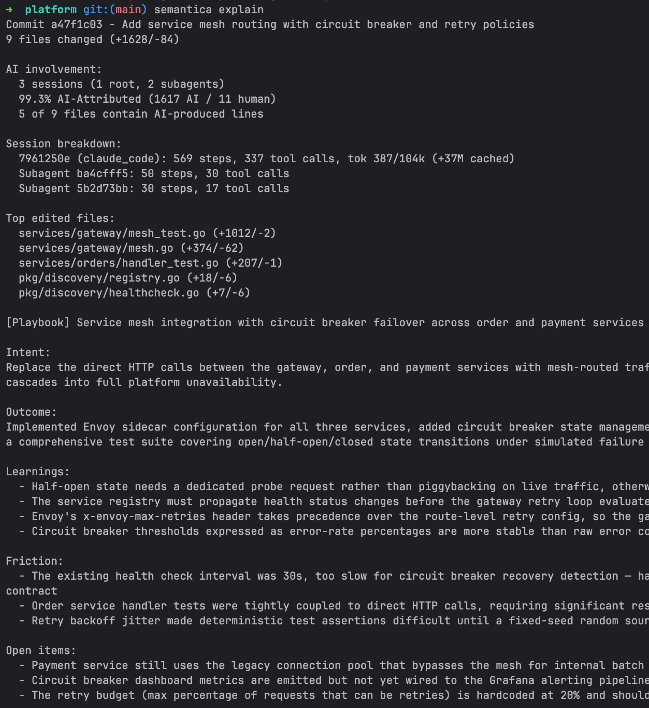

# Features

Detailed guide to Semantica's capabilities.

---

## AI Attribution

Determines what percentage of a commit is AI-attributed by comparing added lines against captured AI tool output.

### How it works

When you run `semantica blame` or `semantica explain`, Semantica diffs the commit against its parent and checks each added line against output captured from AI agent sessions. Lines are classified into three tiers:

| Tier | Name | What it means |
|------|------|---------------|
| Exact | `ai_exact` | Line matches AI tool output character-for-character (after trimming whitespace) |
| Formatted | `ai_formatted` | Match after stripping all whitespace - catches linter/formatter changes (e.g., `func foo(){` vs `func foo() {`) |
| Modified | `ai_modified` | Line is in a diff hunk that overlaps with AI output but doesn't match exactly - the developer likely edited AI-generated code |

AI code hashes are built from assistant-role events containing `Edit` (new_string field) and `Write` (content field) tool calls captured during provider hook events. `Bash` tool calls are only used to detect file deletions (via `rm` commands), not to build line-level code matches.

### What you see

```bash
semantica blame HEAD          # aggregate AI percentage
semantica blame HEAD --json   # per-file breakdown with exact/formatted/modified counts
```

The JSON output includes per-file `ai_percentage`, per-provider breakdown (provider name, model, AI lines), and diagnostics (events considered, payloads loaded, match counts).

### Prerequisites

- Semantica enabled in the repo
- At least one AI provider with hooks installed
- Agent session activity that overlaps with the commit's time window

### Caveats

- Attribution is anchored to the delta window between commit-linked checkpoints. Deferred created files can still pick up AI attribution from earlier history when they were present in the previous commit-linked manifest but committed later.
- Lines that a developer manually edits after AI generation may count as "modified" rather than "exact."
- Carry-forward is per-file, not per-line across windows. If a file already has current-window AI attribution, that file stays current-window authoritative.
- Provider-level attribution (file touched by AI) is available for all providers; line-level payload analysis requires providers that report Edit/Write tool call content.

### Provenance packaging

When Semantica packages per-turn provenance for hosted reporting, it keeps the
full local journal in `.semantica/` but filters file-backed step bundles using
Git ignore rules. Steps whose primary file is ignored by Git are omitted from
the packaged bundle, and mixed metadata paths are reduced to visible repo paths.

---

## Checkpoints and Rewind

Checkpoints are point-in-time snapshots of every file in the repo. Rewind restores the working tree to any previous checkpoint.

### How it works

**Automatic checkpoints** are created on every `git commit`:
1. The pre-commit hook creates a pending checkpoint stub (UUID, timestamp)
2. The background worker completes it by hashing every tracked file plus untracked, non-ignored files (SHA-256, zstd compressed) and writing a manifest (path -> blob hash mapping)

**Manual checkpoints** can be created at any time:
```bash
semantica checkpoint -m "Before big refactor"
```

**Rewind** restores files from a checkpoint's manifest:
```bash
semantica rewind <checkpoint_id>            # restore files, create safety checkpoint first
semantica rewind <checkpoint_id> --exact    # also delete files not in the checkpoint
semantica rewind <checkpoint_id> --no-safety  # skip safety checkpoint (dangerous)
```

By default, rewind creates a safety checkpoint before restoring, so you can undo the rewind.

### What you see

```bash
semantica list                  # checkpoints with ID, timestamp, commit hash, file count
semantica show <id>             # full manifest with per-file blob hashes
semantica rewind <id> --json    # files_restored, files_deleted, safety_checkpoint_id
```

### Caveats

- Rewind operates on the working tree only - it does not modify git history, staged changes, or the index.
- Manifests include git-tracked files plus untracked, non-ignored files. Ignored files are not captured or restored.
- The `--exact` flag deletes files not present in the checkpoint manifest, but always protects `.semantica/`.

---

## Commit Trailers

Semantica always appends a machine-readable checkpoint trailer during the commit-msg hook. Attribution and diagnostics trailers are enabled by default and can be toggled with `semantica set trailers enabled|disabled`.

### How it works

The pre-commit hook writes a handoff file (`.semantica/.pre-commit-checkpoint`) containing the checkpoint ID and timestamp. The commit-msg hook reads this file and appends trailers to the commit message.

When trailer emission is enabled and AI is detected, the trailers look like this:

```
Semantica-Checkpoint: chk_abc123
Semantica-Attribution: 42% claude_code (sonnet) (18/43 lines)
Semantica-Diagnostics: 3 files, lines: 15 exact, 2 modified, 1 formatted
```

- **Checkpoint** - links the commit to its checkpoint ID
- **Attribution** - per-provider AI percentage with line counts (one trailer per provider if multiple contributed). If no AI matches the commit, this becomes `0% AI detected (0/N lines)`.
- **Diagnostics** - aggregate match statistics. If no AI matches the commit, this explains whether no AI events existed in the checkpoint window or whether AI events existed but did not match the committed files.

When trailer emission is disabled:

```text
Semantica-Checkpoint: chk_abc123
```

When no AI sessions exist in the checkpoint window:

```text
Semantica-Checkpoint: chk_abc123
Semantica-Attribution: 0% AI detected (0/141 lines)
Semantica-Diagnostics: no AI events found in the checkpoint window
```

When AI sessions exist but do not modify the committed files:

```text
Semantica-Checkpoint: chk_abc123
Semantica-Attribution: 0% AI detected (0/141 lines)
Semantica-Diagnostics: AI session events found, but no file-modifying changes matched this commit
```

### Prerequisites

- Semantica enabled (`semantica enable`)
- Git hooks installed (happens automatically during enable)
- Attribution and diagnostics trailers enabled if you want those extra trailers (`semantica set trailers enabled`)

### Caveats

- Trailers are skipped if the handoff file is missing (e.g., `git commit --no-verify` skips the pre-commit hook).
- Duplicate trailers are prevented - if a `Semantica-Checkpoint` trailer already exists (e.g., `git commit --amend`), it won't be added again.
- `Semantica-Checkpoint` is always appended when trailer insertion runs. `Semantica-Attribution` and `Semantica-Diagnostics` are controlled together by the `trailers` setting.
- Attribution trailers are best-effort. If attribution cannot be computed at all (for example, the database is unavailable or the hook times out) and trailer emission is enabled, Semantica appends the checkpoint trailer plus `Semantica-Diagnostics: attribution unavailable`.

---

## Playbooks

Playbooks are LLM-generated structured summaries of commits.

### How it works

A playbook is generated by sending the commit diff, attribution stats, and recent session transcript to an LLM. The response is parsed into a structured format:

| Field | Description |
|-------|-------------|
| `title` | Short label (max 10 words) |
| `intent` | What the developer tried to accomplish |
| `outcome` | What was actually achieved |
| `learnings` | Codebase patterns/conventions discovered |
| `friction` | Problems, blockers, annoyances encountered |
| `open_items` | Deferred work, tech debt |
| `keywords` | 5-10 terms that summarize the commit context |

<p align="left">
  
</p>

### What you see

```bash
# Generate a playbook for a commit
semantica explain HEAD --generate
```

### Generation modes

- **Manual**: `semantica explain <commit> --generate` (use `--force` to regenerate)
- **Auto**: Enable with `semantica set auto-playbook enabled` - generates a playbook for every commit in the background after the worker completes

### Prerequisites

- At least one LLM CLI must be installed and accessible: Claude Code (`claude`), Cursor CLI (`agent`), Gemini CLI (`gemini`), or Copilot CLI (`copilot`). The first available provider in this order is used.
- For auto-playbook, the provider must be authenticated and available non-interactively.
- `semantica launcher enable` can move commit-driven background work under the OS launcher backend on supported platforms. This is optional; the default worker path still works without it.
- The launcher is mainly useful when commits are often created through agent-driven workflows and the follow-up background work needs a more reliable execution path through launchd on macOS, systemd user units on Linux, or Task Scheduler on Windows.

### Caveats

- Generation is asynchronous. After `--generate`, run `semantica explain` again after a few seconds to see the result.
- Playbook generation uses bounded diff input to stay within LLM context limits. Commit message and PR suggestions use structured change summaries plus selected per-file excerpts instead of a blind raw-diff prefix. Large diffs may still produce less precise summaries.
- Playbooks are stored locally in `.semantica/lineage.db`.
- Per-repo worker output is written to `.semantica/worker.log`. When the launcher is enabled, launcher-level events also appear in `$SEMANTICA_HOME/worker-launcher.log`.

---

## Commit and PR Suggestions

Semantica can generate commit messages and pull request descriptions from the
current repo state using whichever supported LLM CLI is available first.

### What you see

```bash
semantica suggest commit
semantica suggest commit --json
semantica suggest pr
semantica suggest pr --base origin/main
semantica suggest pr --copy
```

### How it works

- `semantica suggest commit` summarizes staged, unstaged, and untracked changes.
  Most results are a single sentence, but broader diffs may use two short
  adjacent sentences on the same line.
- `semantica suggest pr` compares the current branch against a base branch and
  generates a title and body. If `.github/pull_request_template.md` exists,
  Semantica fills that structure instead of inventing a new one.
- Suggestions use the first available supported LLM CLI in the current
  selection order: Claude Code, Cursor CLI, Gemini CLI, then Copilot CLI.

### Caveats

- `suggest commit` includes untracked files. `suggest pr` uses the branch diff
  against the chosen base and warns when the working tree has uncommitted
  changes.
- Large diffs are summarized from structured change context plus selected file
  excerpts rather than a blind raw-diff prefix.
- Clipboard copy is best-effort and depends on the platform clipboard toolchain.

---

## Implementations

Implementations are Semantica's concrete local record for agent work that often
feels like a single story across repositories.

For the dedicated guide to commands, states, boundaries, and JSON output, see
[implementations.md](implementations.md).

An agent can start in one repo, touch files in another, and produce commits in
both. Semantica maps those related changes under the implementation umbrella so
you can inspect the repos, sessions, commits, and timeline as one unit of work.

### What you see

```bash
semantica implementations
semantica impl <implementation_id>
semantica suggest impl
semantica suggest impl <implementation_id>
semantica implementations link <implementation_id> --session <session_id>
semantica implementations merge <target_id> <source_id>
semantica implementations close <implementation_id>
```

### How it works

- The broker records lightweight cross-repo observations whenever routed agent
  activity is written to a repo.
- The background worker reconciles those observations into implementations using
  deterministic attach rules such as session identity, parent-child session
  relationships, and active branch context.
- Each implementation tracks related repos, repo-local sessions, branches, and
  commits in a global local index.
- When `auto-implementation-summary` is enabled, the worker also generates a
  title and summary once an implementation spans multiple repos and refreshes
  them when the repo scope grows.
- Semantica keeps implementation state as `active`, `dormant`, or `closed`.
  Dormant implementations can still resume when later activity matches strong
  identity signals.
- `semantica suggest impl` adds an advisory layer for titles,
  summaries, review-priority hints, and possible merge candidates.

### Story framing

The word **implementation** is the product object. In practice, it is also the
closest thing to the story of a cross-repo agent effort: one logical piece of
work with a beginning, related edits, and resulting commits spread across one
or more repositories.

### Caveats

- Implementations are local-first and depend on Semantica capture on the
  current machine.
- Cross-repo grouping only works for repositories that are enabled and visible
  to the broker on that machine.
- Manual `link`, `merge`, and `close` commands exist because some long-lived
  sessions and branch patterns are ambiguous by nature.
- Suggestions are advisory only. They do not silently rewrite implementation
  history.

---

## Optional repo connection

Semantica works fully offline by default. If you want hosted features for a repo, authenticate once and then connect that repo:

```bash
semantica auth login
semantica connect
```

If the repo is already connected through a shared workspace, `semantica connect`
can request access instead of creating a second hosted connection.

Semantica packages turn-level provenance locally first. Each completed turn can
produce:

- a prompt blob when the prompt was captured directly
- step provenance blobs for captured tool steps, and for transcript-replayed
  steps when the provider transcript has enough structured detail
- a provenance bundle that ties those blobs together

These artifacts are written to `.semantica/` before any optional hosted sync is
attempted. If the repo is connected, Semantica later performs a best-effort
sync in the background. Failures are logged to `.semantica/worker.log` and
never block the worker or the commit. `semantica connect` also tries to sync a
small initial batch of already-packaged turns and historical commit
attribution that was already captured locally.

### Caveats

- `semantica auth login` is global. `semantica connect` and `semantica disconnect` are repo-local.
- Disconnecting a repo stops future sync attempts from that repo, but local capture and attribution continue to work.
- Shared repos may require approval from a workspace owner or admin before hosted sync starts.
- Additional remote setup may be required depending on where you want attribution to appear.

---

## Egress Redaction

Semantica redacts likely secrets before prompt content or remote sync payloads leave the machine. Local capture and stored blobs remain unchanged.

### How it works

- LLM prompt content is redacted at the shared `llm.Generate` / `llm.GenerateText` boundary.
- Remote sync payloads are sanitized before upload. `remote_url` has embedded credentials, query strings, and fragments stripped before the rest of the payload is scanned.
- Detection uses embedded Gitleaks rules. Matched values are replaced with `[REDACTED]`.

### Caveats

- Redaction is best-effort. Unknown secret formats may still be missed.
- Aggressive matches can remove prompt context and reduce LLM output quality on some diffs or summaries.
- Redaction applies to outbound content only. Local raw capture in `.semantica/` is not rewritten.

---

## Provider Hook Capture

Real-time capture of AI agent activity via provider-specific hooks.

### How it works

When `semantica enable` detects an AI provider, it installs hooks in the provider's configuration file. These hooks are wrapped with a shell guard that silently no-ops when `semantica` is not on PATH, so teammates who clone the repo without Semantica installed see no errors.

The capture lifecycle follows this pattern:

1. **Prompt submitted** - Semantica records the current transcript boundary to a capture state file at `$SEMANTICA_HOME/capture/capture-{key}.json`. The offset format is provider-specific: line count for JSONL-based providers, message index for Gemini, and provider-managed markers for Kiro CLI.
2. **Direct hook events** - When the provider exposes structured tool hooks, Semantica records prompt, file edit, shell, and subagent boundary events immediately.
3. **Agent stop** - Semantica reads the transcript or provider store from the saved offset forward, extracts new events, and routes them through the broker to the correct repo's database.
4. **Turn packaging** - Semantica packages a provenance bundle for the completed turn.
5. **Session close** - Final transcript flush and state cleanup.

Events are matched to repositories by file path (deepest-match rule). Events without file paths are matched by the session's source project path.

### Event types

| Type | When it fires |
|------|---------------|
| `PromptSubmitted` | User submits a prompt - saves transcript offset |
| `ToolStepCompleted` | Provider reports a completed direct tool step such as `Write`, `Edit`, or `Bash` |
| `SubagentPromptSubmitted` | Provider reports the prompt sent to a subagent |
| `AgentCompleted` | Agent finishes responding - replays new provider data and packages the turn |
| `SessionOpened` | Session starts - lifecycle tracking |
| `SessionClosed` | Session ends - fallback capture if completion was missed |
| `ContextCompacted` | Context window compressed - resets offset to EOF |
| `SubagentCompleted` | Sub-agent finishes - captures the delegation boundary and any child transcript data |

### Prerequisites

- Provider detected and hooks installed (`semantica enable` or `semantica agents`)
- `semantica` binary on PATH (hooks silently no-op when the binary is absent)

### Caveats

- Capture state is stored in `$SEMANTICA_HOME/capture/`. The boundary format is provider-specific and may use companion state managed by the provider. If the CLI is upgraded or the capture directory is cleared mid-session, some events may be missed.
- The background worker runs a reconciliation pass to flush any sessions with pending capture state, ensuring no events are lost if a hook invocation was interrupted.
- `semantica tidy --apply` can remove abandoned capture state, stale broker entries, and orphan playbook FTS rows, and mark old pending checkpoints as failed without touching complete checkpoint history.
- Capture is per-machine - activity from a different machine using the same repo is not captured unless that machine also has Semantica enabled.
