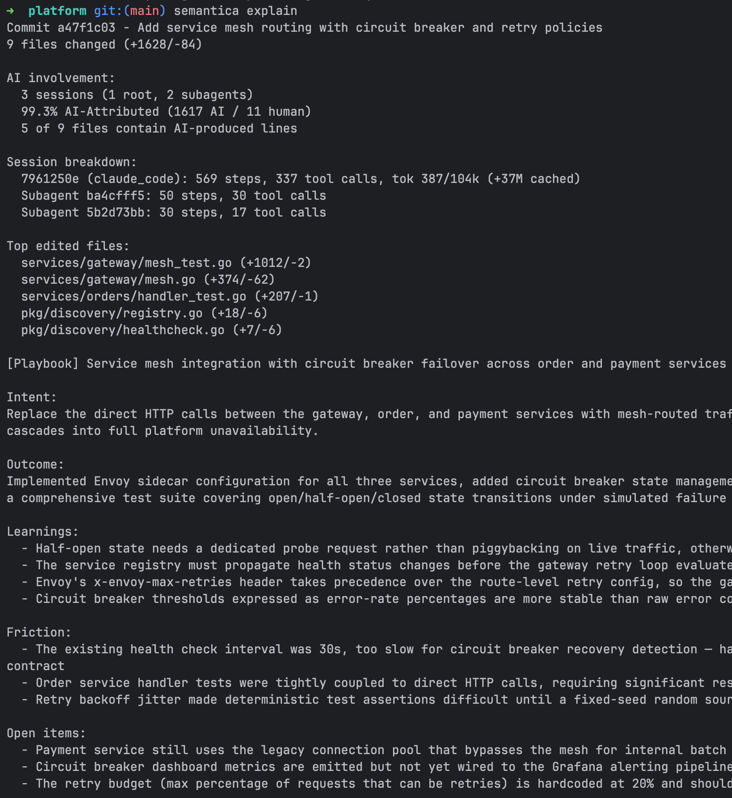

# Features

Detailed guide to Semantica's capabilities.

---

## AI Attribution

Determines what percentage of a commit is AI-attributed by comparing added lines against captured AI tool output.

### How it works

When you run `semantica blame` or `semantica explain`, Semantica diffs the commit against its parent and checks each added line against output captured from AI agent sessions. Lines are classified into three tiers:

| Tier | Name | What it means |
|------|------|---------------|
| Exact | `ai_exact` | Line matches AI tool output character-for-character (after trimming whitespace) |
| Formatted | `ai_formatted` | Match after stripping all whitespace - catches linter/formatter changes (e.g., `func foo(){` vs `func foo() {`) |
| Modified | `ai_modified` | Line is in a diff hunk that overlaps with AI output but doesn't match exactly - the developer likely edited AI-generated code |

Direct attribution uses assistant `Edit` and `Write` output. In v1, `Bash` events support deletion inference only. The default v2 scorer also uses verified workspace deltas captured around Claude Code and Codex Bash tools, including changes made by invoked scripts, formatters, and generators.

### What you see

```bash
semantica blame HEAD          # aggregate AI percentage
semantica blame HEAD --json   # per-file breakdown with exact/formatted/modified counts
```

The JSON output includes per-file `ai_percentage`, line-level AI counts, `ai_provider_only_lines`, per-file `providers` involvement lists, per-commit provider breakdown, and attribution diagnostics. Each file also carries `evidence_class`, the strongest display evidence, plus `evidence_classes`, the full strongest-first list. Tool-delta scoring additionally reports `ai_delta_exact_lines`, `ai_delta_formatted_lines`, and `tool_delta_touch` evidence.

See the [Evidence Contract](evidence-contract.md) for evidence classes, strength levels, and their limits.

### Prerequisites

- Semantica enabled in the repo
- At least one AI provider with hooks installed
- Agent session activity that overlaps with the commit's time window

### Caveats

- Historical carry-forward applies to files added by the commit that were already present in the previous lineage manifest. Modified files do not inherit historical evidence without checkpoint-backed continuity.
- Lines manually edited after direct AI generation may count as "modified" rather than "exact." Tool-delta lines must survive exactly or after whitespace normalization.
- Tool-delta scoring is on by default. Opt out with `attribution_v2: false` in `.semantica/settings.json` or `SEMANTICA_ATTRIBUTION_V2=0`.
- Tool-delta evidence shows that a changed line appeared while an agent-issued tool was running. It does not prove exclusive authorship: concurrent saves, formatters, and file watchers can produce the same evidence.
- Semantica snapshots eligible Bash calls when capture state is active, even if `attribution_v2` is disabled. The flag controls scoring, not capture. Calls without capture state are ignored. On-demand or recomputed attribution can use earlier captures; enabling the flag alone does not update stored results.
- Carry-forward is per-file. Current-window attribution remains authoritative when an eligible created file already has AI evidence.
- Provider-level attribution (file touched by AI) is available for all providers. When a provider reports only file-touch metadata, those lines are reported as `ai_provider_only_lines` and excluded from the headline AI percentage.
- When weaker evidence contributes to a file that also has line-level matches, Semantica keeps the strongest class as `evidence_class` and preserves the weaker signals in `evidence_classes`.

### Provenance packaging

When Semantica packages per-turn provenance for hosted reporting, it keeps the
full local journal in `.semantica/` but filters file-backed step bundles using
Git ignore rules. Steps whose primary file is ignored by Git are omitted from
the packaged bundle, and mixed metadata paths are reduced to visible repo paths.

---

## Commit Lineage

Semantica records lineage during each Git commit. Each record links the commit,
file manifest, captured sessions, attribution, and optional playbook data.

Developers normally use Git commits and pull requests as the review surface.
Commands such as `semantica blame`, `semantica explain`, `semantica list`,
`semantica show`, and `semantica transcripts` read from the lineage records
behind those commits.

---

## Commit Trailers

Semantica always appends a machine-readable lineage trailer during the commit-msg hook. Attribution and diagnostics trailers are enabled by default and can be toggled with `semantica set trailers enabled|disabled`.

### How it works

The pre-commit hook writes a handoff file (`.semantica/.pre-commit-checkpoint`) containing the internal lineage record ID and timestamp. The commit-msg hook reads this file and appends trailers to the commit message.

When trailer emission is enabled and AI is detected, the trailers look like this:

```
Semantica-Checkpoint: chk_abc123
Semantica-Attribution: 42% claude_code (sonnet) (18/43 lines)
Semantica-Diagnostics: 3 files, lines: 15 exact, 2 modified, 1 formatted
```

- **Lineage ID** - `Semantica-Checkpoint` links the commit to Semantica's internal lineage record
- **Attribution** - per-provider AI percentage with line-level counts (one trailer per provider if multiple contributed). Provider-touch-only evidence is shown as `provider-touched N lines` instead of being mixed into the headline percentage. If no AI evidence matches the commit, this becomes `0% AI detected (0/N lines)`.
- **Diagnostics** - aggregate match statistics. If no AI matches the commit, this explains whether no AI events existed in the commit lineage window, whether AI events existed but did not match the committed files, or whether only provider-touch evidence was available.

When trailer emission is disabled:

```text
Semantica-Checkpoint: chk_abc123
```

When no AI sessions exist in the commit lineage window:

```text
Semantica-Checkpoint: chk_abc123
Semantica-Attribution: 0% AI detected (0/141 lines)
Semantica-Diagnostics: no AI events found in the commit lineage window
```

When AI sessions exist but do not modify the committed files:

```text
Semantica-Checkpoint: chk_abc123
Semantica-Attribution: 0% AI detected (0/141 lines)
Semantica-Diagnostics: AI session events found, but no file-modifying changes matched this commit
```

When a provider reports file-touch evidence without line-level payloads:

```text
Semantica-Checkpoint: chk_abc123
Semantica-Attribution: cursor provider-touched 12 lines
Semantica-Diagnostics: 1 files, 12 provider-touched lines (no line-level evidence)
```

### Prerequisites

- Semantica enabled (`semantica enable`)
- Git hooks installed (happens automatically during enable)
- Attribution and diagnostics trailers enabled if you want those extra trailers (`semantica set trailers enabled`)

### Caveats

- Trailers are skipped if the handoff file is missing (e.g., `git commit --no-verify` skips the pre-commit hook).
- Duplicate trailers are prevented - if a `Semantica-Checkpoint` trailer already exists (e.g., `git commit --amend`), it won't be added again.
- `Semantica-Checkpoint` is always appended when trailer insertion runs. It carries the internal lineage record ID. `Semantica-Attribution` and `Semantica-Diagnostics` are controlled together by the `trailers` setting.
- Attribution trailers are best-effort. If attribution cannot be computed at all (for example, the database is unavailable or the hook times out) and trailer emission is enabled, Semantica appends the lineage trailer plus `Semantica-Diagnostics: attribution unavailable`.

---

## Playbooks

Playbooks are LLM-generated structured summaries of commits.

### How it works

A playbook is generated by sending the commit diff, attribution stats, and recent session transcript to an LLM. The response is parsed into a structured format:

| Field | Description |
|-------|-------------|
| `title` | Short label (max 10 words) |
| `intent` | What the developer tried to accomplish |
| `outcome` | What was actually achieved |
| `learnings` | Codebase patterns/conventions discovered |
| `friction` | Problems, blockers, annoyances encountered |
| `open_items` | Deferred work, tech debt |
| `keywords` | 5-10 terms that summarize the commit context |

<p align="left">
  
</p>

### What you see

```bash
# Generate a playbook for a commit
semantica explain HEAD --generate
```

### Generation modes

- **Manual**: `semantica explain <commit> --generate` (use `--force` to regenerate)
- **Auto**: Enable with `semantica set auto-playbook enabled` - generates a playbook for every commit in the background after the worker completes

### Prerequisites

- At least one LLM CLI must be installed and accessible: Claude Code (`claude`), Codex (`codex`), Cursor CLI (`agent`), Gemini CLI (`gemini`), Copilot CLI (`copilot`), or Kiro CLI (`kiro-cli`). The first available provider in this fallback order is used.
- For auto-playbook, the provider must be authenticated and available non-interactively.

### Background processing

- `semantica launcher enable` can move commit-driven background work under the OS launcher backend on supported platforms. This is optional; the default worker path still works without it.
- The launcher is mainly useful when commits are often created through agent-driven workflows and the follow-up background work needs a more reliable execution path through launchd on macOS, systemd user units on Linux, or Task Scheduler on Windows.
- Commit-linked work runs in repository order. Transient failures retry with bounded backoff, while a terminal failure blocks later records until it is fixed and retried with `semantica worker retry <checkpoint-id>`.
- Launcher backends drain every 30 minutes to recover scheduled retries and expired worker leases. `semantica doctor` reports scheduled retries and blocked queues.
- After replacing the Semantica binary, `semantica launcher refresh` re-registers an enabled launcher against the current binary and drains queued work. The installer attempts this automatically when it is not running as root.
- `semantica status --json` reports the latest checkpoint, queue blockage, component-level audit readiness, attribution version, and manifest version, scope, and integrity classification. The named policy indicates whether hosted sync is required.

### Caveats

- Generation is asynchronous. After `--generate`, run `semantica explain` again after a few seconds to see the result.
- Playbook generation uses bounded diff input to stay within LLM context limits. Commit message and PR suggestions use structured change summaries plus selected per-file excerpts instead of a blind raw-diff prefix. Large diffs may still produce less precise summaries.
- Playbooks are stored locally in `.semantica/lineage.db`.
- Per-repo worker output is written to `.semantica/worker.log`. When the launcher is enabled, launcher-level events also appear in `$SEMANTICA_HOME/worker-launcher.log`.

---

## Session Handoff

`semantica handoff --write` prepares a redacted markdown bundle for continuing work in a fresh agent session.

### How it works

The command first resolves an active Semantica-tracked agent session for the current repo. If the active turn state has already been cleaned up, it falls back to the most recent persisted parent session in `lineage.db`. When multiple providers are active in an interactive terminal, Semantica shows a provider picker. Non-interactive callers get the active provider list and a `--from <provider>` hint instead. Use `--from <provider>` to source the bundle from a specific recent provider session, such as `claude-code`, `cursor`, `gemini-cli`, `copilot`, `kiro-cli`, or `kiro-ide`, even when another agent is currently active. The writer then reads recent captured prompts, the last assistant message, file-touch context, recent commits with useful commit-message bodies, and uncommitted working-tree context, then writes the result to `.semantica/handoff.md`. Captured prose and diff excerpts are redacted before they are written, and prompt text is rendered in fenced blocks so multi-line prompts stay readable.

### What you see

```bash
semantica handoff --write
semantica handoff --write --from claude-code
semantica handoff continue
```

The writer prints the saved path and does not echo the handoff bundle into the originating chat. In an interactive terminal, it asks whether to continue in a fresh session immediately. Accepting the prompt chains into `semantica handoff continue`; non-interactive callers and declined prompts receive a manual `semantica handoff continue` hint instead. `semantica handoff continue` reads the bundle and either launches the matching agent or prints a command or manual instruction with the absolute bundle path.

### Caveats

- The handoff writer supports Semantica-tracked provider sessions.
- If lineage data is missing or the session is not yet registered locally, Semantica writes a minimal bundle with a generic note instead of exposing raw database errors.
- Auto-launch is available on Unix when the matching CLI binary is installed for Claude Code, Cursor, Gemini CLI, Copilot CLI, or Kiro CLI. Kiro IDE receives a manual-launch hint because it has no CLI surface for this flow. `--print` always prints a copyable command instead of spawning.

---

## Commit and PR Suggestions

Semantica can generate commit messages and pull request descriptions from the
current repo state using whichever supported LLM CLI is available first.

### What you see

```bash
semantica suggest commit
semantica suggest commit --json
semantica suggest pr
semantica suggest pr --base origin/main
semantica suggest pr --copy
```

### How it works

- `semantica suggest commit` summarizes staged, unstaged, and untracked changes.
  Most results are a single sentence, but broader diffs may use two short
  adjacent sentences on the same line.
- `semantica suggest pr` compares the current branch against a base branch and
  generates a title and body. If `.github/pull_request_template.md` exists,
  Semantica fills that structure instead of inventing a new one.
- Suggestions use the first available supported LLM CLI in the current
  selection order: Claude Code, Codex, Cursor CLI, Gemini CLI, GitHub
  Copilot CLI, then Kiro CLI.

### Caveats

- `suggest commit` includes untracked files. `suggest pr` uses the branch diff
  against the chosen base and warns when the working tree has uncommitted
  changes.
- Large diffs are summarized from structured change context plus selected file
  excerpts rather than a blind raw-diff prefix.
- Clipboard copy is best-effort and depends on the platform clipboard toolchain.

---

## Optional repo connection

Semantica works fully offline by default. If you want hosted features for a repo, authenticate once and then connect that repo:

```bash
semantica auth login
semantica connect
```

If the repo is already connected through a shared workspace, `semantica connect`
can request access instead of creating a second hosted connection.

Semantica packages turn-level provenance locally first. Each completed turn can
produce:

- a prompt blob when the prompt was captured directly
- step provenance blobs for captured tool steps, and for transcript-replayed
  steps when the provider transcript has enough structured detail
- a provenance bundle that ties those blobs together

These artifacts are written to `.semantica/` before any optional hosted sync is
attempted. If the repo is connected, Semantica later performs a best-effort
sync in the background. Failures are logged to `.semantica/worker.log` and
never block the worker or the commit. `semantica connect` also tries to sync a
small initial batch of already-packaged turns and historical commit
attribution that was already captured locally.

### Caveats

- `semantica auth login` is global. `semantica connect` and `semantica disconnect` are repo-local.
- Disconnecting a repo stops future sync attempts from that repo, but local capture and attribution continue to work.
- Shared repos may require approval from a workspace owner or admin before hosted sync starts.
- Additional remote setup may be required depending on where you want attribution to appear.

---

## Egress Redaction

Semantica redacts likely secrets before prompt content or remote sync payloads leave the machine. Local capture and stored blobs remain unchanged.

### How it works

- LLM prompt content is redacted at the shared `llm.Generate` / `llm.GenerateText` boundary.
- Remote sync payloads are sanitized before upload. `remote_url` has embedded credentials, query strings, and fragments stripped before the rest of the payload is scanned.
- Detection uses embedded Gitleaks rules. Matched values are replaced with `[REDACTED]`.

### Caveats

- Redaction is best-effort. Unknown secret formats may still be missed.
- Aggressive matches can remove prompt context and reduce LLM output quality on some diffs or summaries.
- Redaction applies to outbound content only. Local raw capture in `.semantica/` is not rewritten.

---

## Provider Hook Capture

Real-time capture of AI agent activity via provider-specific hooks.

### How it works

When `semantica enable` detects an AI provider, it installs hooks in the provider's configuration file. These hooks are wrapped with a shell guard that silently no-ops when `semantica` is not on PATH, so teammates who clone the repo without Semantica installed see no errors.

The capture lifecycle follows this pattern:

1. **Prompt submitted** - Semantica records capture state at `$SEMANTICA_HOME/capture/capture-{key}.json`. The offset format is provider-specific: line count for JSONL-based providers, message index for Gemini, and provider-managed markers where replay is enabled.
2. **Direct hook events** - When the provider exposes structured tool hooks, Semantica records prompt, file edit, shell, and subagent boundary events immediately.
3. **Agent stop** - When a provider relies on replay, Semantica reads the transcript or provider store from the saved offset forward, extracts new events, and routes them through the broker. Providers with complete direct hooks use stop mainly to close the session.
4. **Turn packaging** - Semantica packages a provenance bundle for the completed turn.
5. **Session close** - Final transcript flush and state cleanup.

Events are matched to repositories by file path (deepest-match rule). Events without file paths are matched by the session's source project path.

### Event types

| Type | When it fires |
|------|---------------|
| `PromptSubmitted` | User submits a prompt - saves transcript offset |
| `ToolStepCompleted` | Provider reports a completed direct tool step such as `Write`, `Edit`, or `Bash` |
| `SubagentPromptSubmitted` | Provider reports the prompt sent to a subagent |
| `AgentCompleted` | Agent finishes responding - replays new provider data and packages the turn |
| `SessionOpened` | Session starts - lifecycle tracking |
| `SessionClosed` | Session ends - fallback capture if completion was missed |
| `ContextCompacted` | Context window compressed - resets offset to EOF |
| `SubagentCompleted` | Sub-agent finishes - captures the delegation boundary and any child transcript data |

### Prerequisites

- Provider detected and hooks installed (`semantica enable` or `semantica agents`)
- `semantica` binary on PATH (hooks silently no-op when the binary is absent)

### Health checks

Use `semantica doctor` to verify local capture health without changing repo state:

```bash
semantica doctor
semantica doctor --json
```

Doctor checks the resolved CLI binary, PATH conflicts, launcher state, provider hooks, Git hooks, active and deferred capture state, worker lock and queue health, recent provider events, hosted sync manifests, recent hook errors, provider configuration risks, repo connection, and authentication. Exit codes are `0` for ok, `1` for warnings, and `2` for failures.

#### Hook benchmark diagnostics

Detailed hook timing is disabled by default. Enable it temporarily with a
repository marker:

```bash
mkdir -p .semantica/doctor
touch .semantica/doctor/bench.enabled
```

Alternatively, set `SEMANTICA_DOCTOR_BENCH=true` in the agent's environment.
Records are appended to `.semantica/doctor/bench.jsonl`. They include hook
outcomes and, for tool-window capture, per-stage timings. Recording adds minor
diagnostic overhead.

Summarize recorded tool-window hooks with:

```bash
semantica doctor hook-bench
semantica doctor hook-bench --since 24h
semantica doctor hook-bench --last 100 --json
```

The report includes pre-hook, post-hook, and paired latency percentiles,
per-stage timings, outcomes, partial reasons, and unmatched hook counts.

Remove `.semantica/doctor/bench.enabled` or unset
`SEMANTICA_DOCTOR_BENCH` to disable recording.

### Caveats

- Capture state is stored in `$SEMANTICA_HOME/capture/`. The boundary format is provider-specific and may use companion state managed by the provider. If the CLI is upgraded or the capture directory is cleared mid-session, some events may be missed.
- The background worker attempts to reconcile pending capture state owned by the repository it is processing. Cross-repository, unowned, and orphaned segments are reported by `semantica doctor` and may leave evidence incomplete.
- `semantica tidy --apply` can recover or remove stale tool windows, remove abandoned capture state, prune stale broker entries, and mark old pending commit snapshots as failed without touching complete lineage history.
- Capture is per-machine - activity from a different machine using the same repo is not captured unless that machine also has Semantica enabled.
